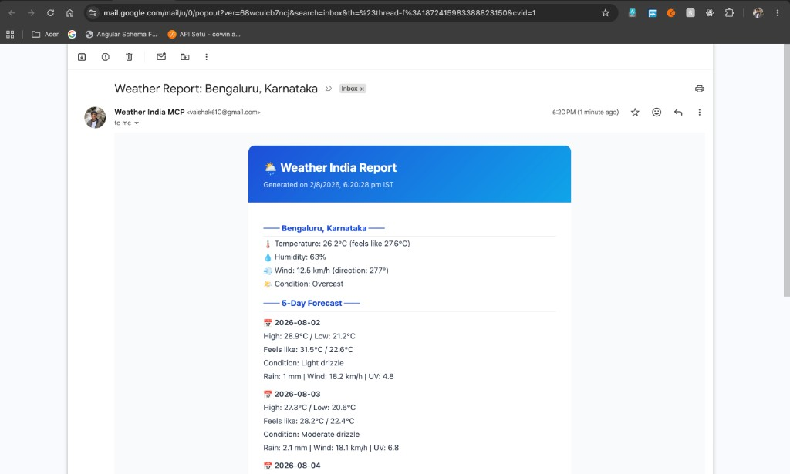
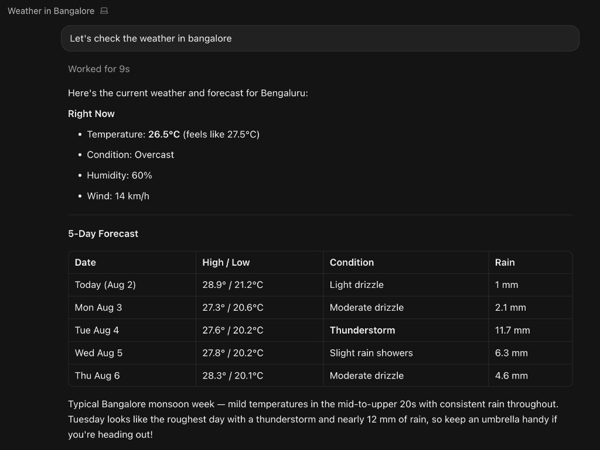
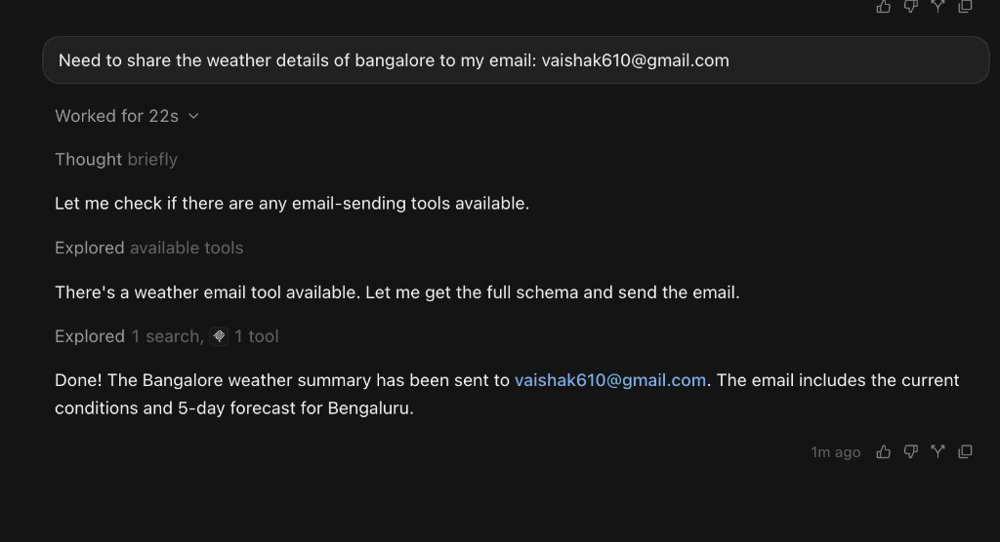

# Weather India MCP

A [Model Context Protocol (MCP)](https://modelcontextprotocol.io) server that provides real-time weather forecasts and alerts for India's major metro cities, powered by the [Open-Meteo API](https://open-meteo.com) (free, no API key required).

## Tools

| Tool | Description |
|---|---|
| `get_forecast` | Current weather + 5-day forecast for any location by latitude/longitude |
| `get_india_city_forecast` | Current weather + 5-day forecast for a named Indian metro city |
| `get_india_weather_alerts` | Scans all Indian metros and returns active severe weather alerts |
| `share_weather_via_email` | Fetches weather for a city or coordinates and emails a formatted summary to any address |

### Supported Cities

Mumbai, Delhi, Bengaluru, Hyderabad, Chennai, Kolkata, Ahmedabad, Pune, Jaipur, Lucknow, Chandigarh, Bhopal, Thiruvananthapuram, Guwahati, Patna

### Alert Severity Levels

- **Extreme** — temperature ≥ 45°C, cyclonic winds ≥ 90 km/h, violent rain/hail/thunderstorms
- **Severe** — temperature ≥ 42°C, winds ≥ 60 km/h, heavy rain, dangerous heat+humidity
- **Moderate** — temperature ≥ 40°C, winds ≥ 40 km/h, moderate rain/snow

## Prerequisites

- [Node.js](https://nodejs.org) v18 or later
- [Cursor](https://cursor.com) (or any MCP-compatible client)

## Setup

### 1. Clone and install dependencies

```bash
git clone https://github.com/YOUR_USERNAME/weather.git
cd weather
npm install
```

### 2. Build

```bash
npm run build
```

This compiles TypeScript to `build/index.js` and makes it executable.

### 3. Configure Cursor

Add the server to your Cursor MCP config at `~/.cursor/mcp.json`:

```json
{
  "mcpServers": {
    "weather": {
      "command": "node",
      "args": ["/absolute/path/to/weather/build/index.js"]
    }
  }
}
```

Replace `/absolute/path/to/weather` with the actual path where you cloned the repo (e.g. `/Users/yourname/weather`).

### 4. Restart Cursor

After saving `mcp.json`, restart Cursor or reload the window (`Cmd+Shift+P` → **Reload Window**). The three weather tools will appear under **Settings → MCP**.

## Usage Examples

Once configured, you can ask your AI assistant things like:

- *"What's the weather in Mumbai right now?"*
- *"Are there any severe weather alerts across Indian cities today?"*
- *"Give me the 5-day forecast for Chennai."*
- *"What's the weather at latitude 28.6, longitude 77.2?"*
- *"Share the Bengaluru weather summary to myemail@gmail.com"*

## Demo

### 1. City Forecast — `get_india_city_forecast`

Ask for the weather in any supported Indian city and get current conditions plus a structured 5-day forecast.



---

### 2. Email Sharing — `share_weather_via_email`

Ask the assistant to share weather details to an email address. It fetches live data and dispatches a formatted summary instantly.



---

### 3. Email Received

The recipient gets a clean HTML email with the city name, current conditions, and the full 5-day forecast — including any active weather alerts in the subject line.



## Development

```bash
# Watch mode — auto-recompiles on save
npm run watch
```

## Email Setup (for `share_weather_via_email`)

The email tool sends weather summaries via SMTP. Configure it in `~/.cursor/mcp.json` under the `weather` server's `env` block:

```json
"env": {
  "SMTP_HOST": "smtp.gmail.com",
  "SMTP_PORT": "587",
  "SMTP_USER": "your-gmail@gmail.com",
  "SMTP_PASS": "your-app-password",
  "SMTP_FROM": "Weather India MCP <your-gmail@gmail.com>"
}
```

**For Gmail:** Generate an [App Password](https://myaccount.google.com/apppasswords) (requires 2FA enabled) and use it as `SMTP_PASS`. Your regular Gmail password will not work.

Works with any SMTP provider — just change `SMTP_HOST` and `SMTP_PORT` accordingly (e.g. Outlook, Zoho, custom SMTP).

## No API Key Required

This server uses [Open-Meteo](https://open-meteo.com), which is completely free and requires no authentication.
